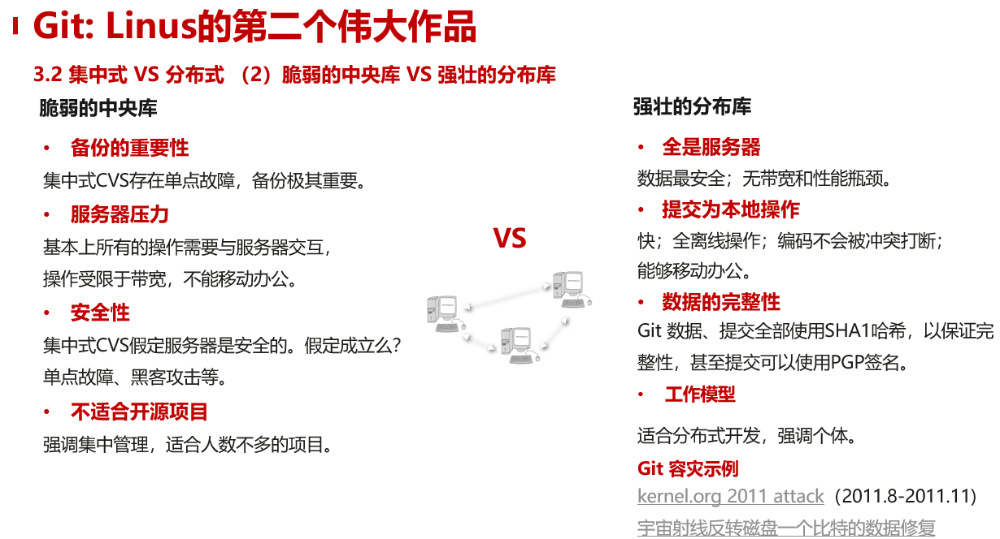
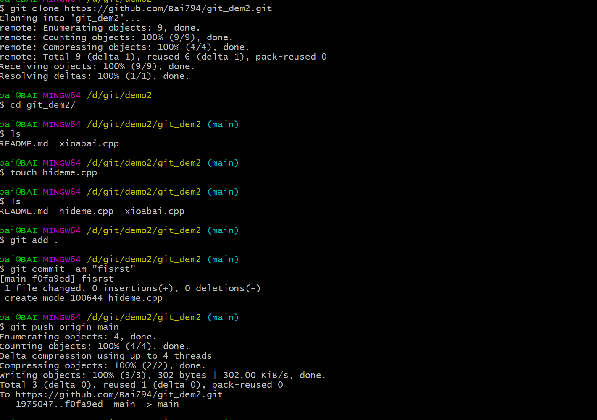
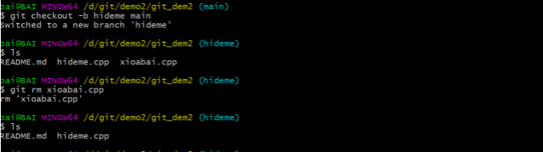
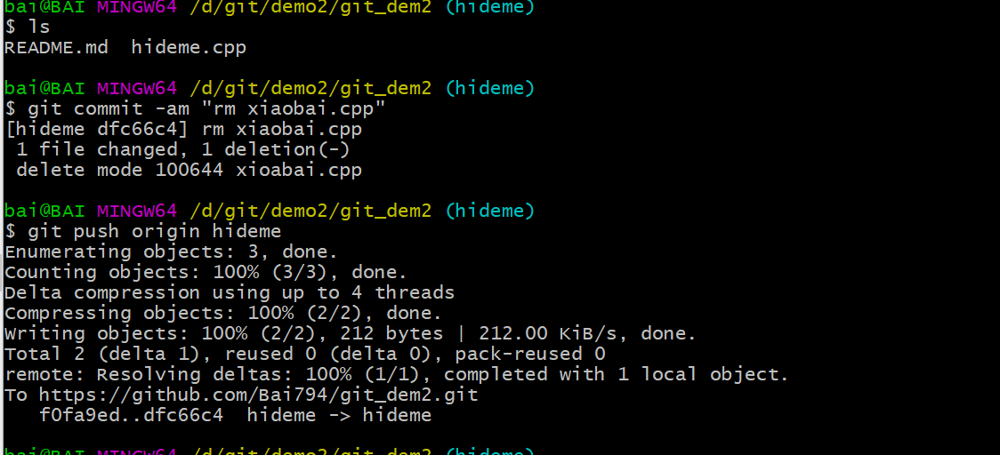
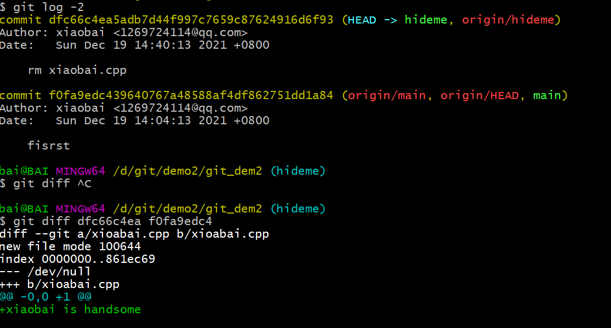
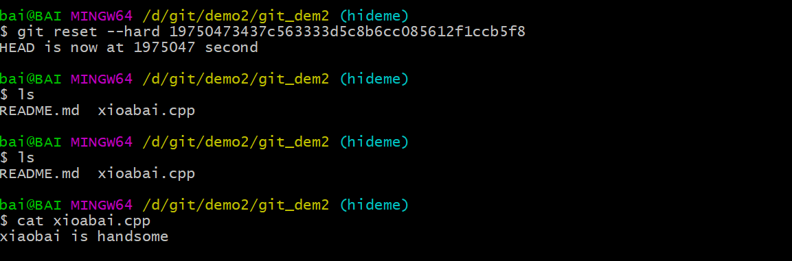
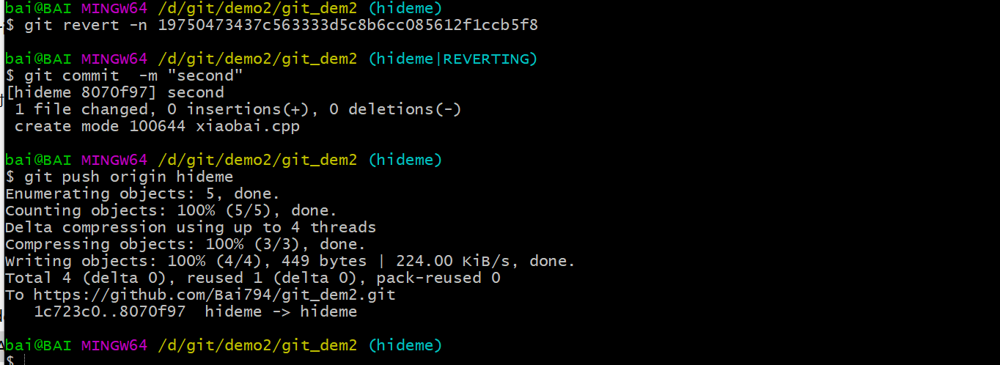
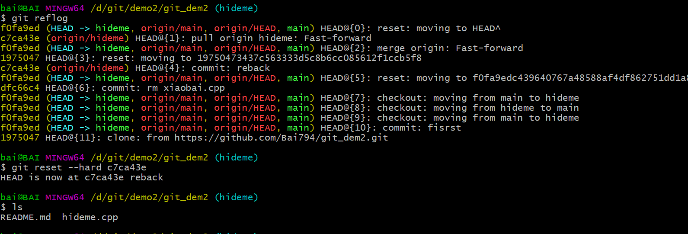
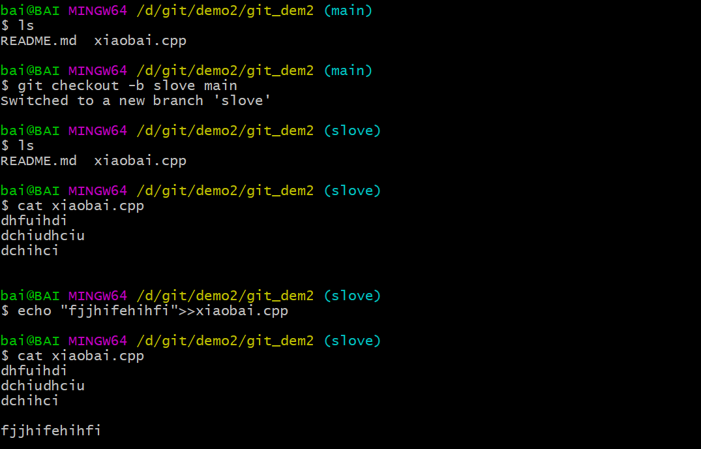
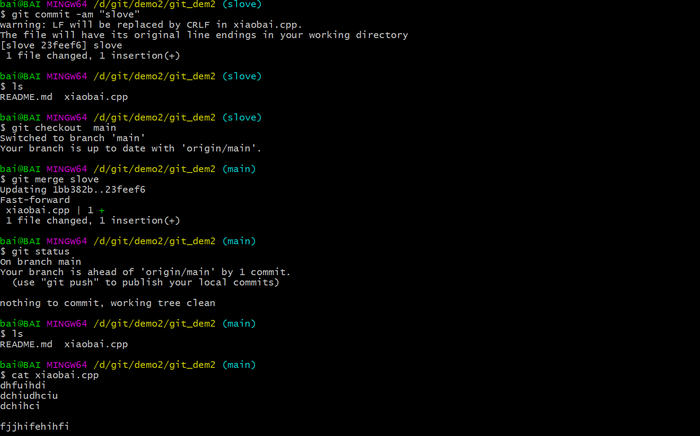

# git的初步认识

## 什么是版本控制 有哪些  

版本控制是一种记录一个或若干文件内容变化，以便将来查阅特定版本修订情况的系统，方便查看更改历史，备份以及恢复以前的版本，保证多人的协作不出问题。早期的版本有diff patch RCS(最早期的本地版本控制）   CVS(集中式） SVN(集中式）        GIT(分布式）

## 集中式与分布式的区别

集中式版本控制工具，几乎所有的动作都需要服务器参与，并且数据安全性与服务器关系很大。

Git是分布式版本控制工具，除了与服务器之前进行按需同步之外，所有的提交操作都不需要服务器。



<br/>

## git 的安装

这里我就不用详细说了，网上资源很多 ，这里推荐一个链接很详细，里面码云和git的配置，GitHub也是同理

[https://www.it235.com/%E5%AE%9E%E7%94%A8%E5%B7%A5%E5%85%B7/Git/git.html#git%E5%AE%89%E8%A3%85](https://)

<br/>

## git的基本命令

在了解git命令之前需要了解git的三种工作区域和文件的状态

### 工作区

1.版本库(Repository)

```
在工作区中有一个隐藏目录.git，这个文件夹就是Git的版本库，里面存放了Git用来管理该工程的所有版本数据，说白了就叫
本地仓库
```

2.工作区(Working Directory)

```
日常工作的代码文件或者文档所在的文件夹
```

3.暂存区(stage)

```
一般存放在工程根目录 .git/index文件中，所以我们也可以把暂存区叫作索引（index）
```

### 文件的状态

1.已提交(committed)

```
就是说该文件已经被安全地保存在本地数据库中了
```

2.已暂存(staged)

```
就是把已修改的文件放在下次提交时要保存的清单中。已暂存(staged)的文件就是被已跟踪(tracked)的文件，是指该文件被
纳入了版本控制管理的文件

git add [file]   file 是你需要纳入版本控制文件的文件名

如果需要添加多个文件到暂存区 

git add [file1] [file2] ...

如果是当前目录下所有的文件使用

git add .

```

3.已修该(modified)

```
修改了某个已跟踪的文件，但还没有提交保存,这个时候你就需要把你修改的文件提交到本地仓库中
使用命令如下
git add file    file 你要保存的文件名
git commit -m "message"  message 就是你要提交的信息
也可以使用
git commit -am  "message"  我建议使用这一条命令,可以直接提交以被跟踪的文件到本地仓库
```

## 常用的命令

下面我将列出常用的git命令，在这里尤其需要提示一下 git status 和git log这两个命令，这两个命令一定要常用，很多时候我们合并更新分支出错的时候，可以根据这两个命令看当前的一个状态和解决方法提示

```
工程准备 git init/git clone

新增/删除/移动文件到暂存区 git add/ git rm/ git mv

查看工作区 git diff/ git status

提交更改的文件 git commit

查看日志 git log

推送远端仓库 git push

分支管理 git branch/git checkout /git branch –d/git pull

分支合并 git merge/git rebase
```

***

### 本地基本提交推送

<br/>



首先我先利用 git clone 克隆远端服务器的一个工程 在新建了一个 hideme.cpp文件 在推送到远端

***

### 本地分支的新建并推送到远端

很多时候我们克隆下来一个master或者main主分支，会新建一个自己的分子修改代码并提交，以免影响到主分子





```
通过 git checkout -b new_branch old_branch 新建了一个hideme分支并把当前分支目录切换到hideme,后面跟的一个main 表示复制一下main
分支到我新建的分支下

然后我在hideme分支下删除了一个xiaobai.cpp文件并推送到远端hideme 分支
```

***

### 回退版本

<br/>

现在我后悔删除 xiaobai.cpp文件 怎么回退版本，恢复xiaobai.cpp

首先我们可以通过 git log -2 打印最近两次版本的操作 然后通过diff 来比较两个版本的差异



<br/>

我们可以通过git reset --hard +版本号实现版本回退

也可以 git reset --hard HEAD^ 回退上一次版本

git reset --hard HEAD~3 回到之前三次的版本 依次类推



好，现在我们本地的xioabai.cpp文件已经恢复了 ，现在我们想更新到远程仓 怎么办

```
如果我们使用 git push origin <branch name>(分支名称) 此时会报错,这是因为我们使用  git reset 是强制其回到某个节点，那个节点之后的

节点就不存在了,而远端的仓库却保存着之后的节点，所以会报出你的仓库版本太低的错误而不能推送到远端

这个时候我们只有强制推送，采用如下命令

git push -f origin <branch name>
```

所以采用git reset 会删除节点之后的节点，这种方式不推荐

我们可以采用 git revert -n 命令来避免以上问题，具体步骤如下

```
1.使用git log 找到你误提交之前的版本号  git log --name-status 看各个节点修改的详细信息

2.git revert -n 版本号

3.git commit -m xxxx 提交

4.git push 推送到远程

```



大家可以参考链接 [https://www.cnblogs.com/aligege/p/10221174.html](https://)  详细看一下git reset 和git revert的区别

***

### 恢复新版本

<br/>

如果有一天你又想恢复到新版本怎么办  git log 会找不到新版本的commit id，这时候可以使用 git reflog  命令

git reflog 可以查看所有分支的所有操作记录（包括commit和reset的操作），包括已经被删除的commit记录，git log则不能察看已经删除了的commit记录，而且跟进结果可以回退道某一个修改



可以看到 xioabai.cpp又没有了

***

### 分支的合并

我们发现主分支main代码有点bug，需要你及时修改 ，我们可以新建一个分支copy 一下 main分支 ，在我们新建的分支修改bug完后可以通过git merge 合并到main分支



在我们新建分支slove 添加了一句话，在slove分支上提交后就可以在切换到main分支使用git merge 合并到main分支



这部分可以参考git 官网的链接[https://git-scm.com/book/zh/v2/Git-%E5%88%86%E6%94%AF-%E5%88%86%E6%94%AF%E7%9A%84%E6%96%B0%E5%BB%BA%E4%B8%8E%E5%90%88%E5%B9%B6](https://)
  